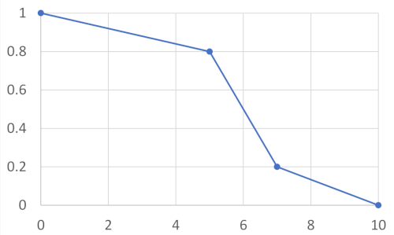

# DEA-robustness

DEA-robustness is a library implementing methods for robustness analysis in context of Data Envelopment Analysis.
It provides an API to obtain the robust outcomes for four points of view, i.e. the efficiency
scores, distance to the best DMU, efficiency ranks and pairwise preferences.

The library offers methods for both exact analysis providing the exact outcomes (using the mathematical programming)
and the stochastic analysis for obtaining the distribution of measures (performed with Monte Carlo simulation).

## Application Programming Interface

### Dependency

To add a dependency in your project's pom.xml use the following:

    <dependency>
        <groupId>io.github.alabijak</groupId>
        <artifactId>dea-robustness</artifactId>
        <version>1.0.0</version>
    </dependency>

### Usage

The software provides methods for robustness analysis for Data Envelopment Analysis with ratio-based (CCR)
and value based additive (VDEA) efficiency model.

Let us consider an example of 5 DMUs (A-E) evaluated with 2 inputs and 1 output:

| DMU | in1 | in2 | out1 |
|-----|-----|-----|------|
| A   | 1   | 2   | 1    |
| B   | 5   | 7   | 10   |
| C   | 4   | 2   | 5    |
| D   | 7   | 4   | 7    |
| E   | 3   | 8   | 12   |

To evaluate the DMUs' performances, we need to create a
_[ProblemData](https://alabijak.github.io/dea-robustness/put/dea/robustness/ProblemData.html)_
object with considered problem setting. For CCR model, we use the following code:

    var inputs = new double[][]{
        new double[]{1,2},
        new double[]{5,7},
        new double[]{4,2},
        new double[]{7,4},
        new double[]{3,8}};
    var outputs = new double[][]{
        new double[]{1},
        new double[]{10},
        new double[]{5},
        new double[]{7},
        new double[]{12}};
    var data = new ProblemData(inputs, outputs, 
        List.of("in1", "in2"), List.of("out1"));

To perform the analysis using the VDEA model
the _[ProblemData](https://alabijak.github.io/dea-robustness/put/dea/robustness/ProblemData.html)_ class must be
replaced
with
its inherited class
_[VDEAProblemData](https://alabijak.github.io/dea-robustness/put/dea/robustness/VDEAProblemData.html)_.

The problem definition may be enhanced with custom weight constraints. For example to
introduce the constraint in a form:

    w_in1 - 0.5 w_in2 >= 0

the following code must be added:

    data.addWeightConstraint(new Constraint(
                ConstraintOperator.GEQ,
                0,
                Map.of("in1", 1.0, "in2", -0.5)
        ));

For VDEA model we can also define the marginal function shapes (default functions are linear).
For example, for input _in1_, we define a marginal function shape presented below:

    data.setFunctionShape("in1", List.of(
                new Pair<>(0, 1.0),
                new Pair<>(5, 0.8),
                new Pair<>(7, 0.2),
                new Pair<>(10.0, 0.0)
        ));

After defining the problem, we can find the extreme efficiency scores and efficiency distribution
as follows:

    var extremeEfficiencies = new CCRExtremeEfficiencies();
    var minEfficiencies = extremeEfficiencies.minEfficiencyForAll(data);
    var maxEfficiencies = extremeEfficiencies.maxEfficiencyForAll(data);
    var superEfficiency = extremeEfficiencies.superEfficiencyForAll(data);
    
    var smaaEfficiency = new CCRSmaaEfficiency(100, 3);
    var efficiencyDistribution = smaaEfficiency.efficiencyDistribution(data);

In a similar way, we can find the robust outcomes for other points of view, i.e.
efficiency distances to the best unit (for VDEA,
_[ExtremeDistances](https://alabijak.github.io/dea-robustness/put/dea/robustness/ExtremeDistances.html)_,
_[SmaaDistance](https://alabijak.github.io/dea-robustness/put/dea/robustness/SmaaDistance.html)_), efficiency
ranks (_[ExtremeRanks](https://alabijak.github.io/dea-robustness/put/dea/robustness/ExtremeRanks.html)_,
_[SmaaRanks](https://alabijak.github.io/dea-robustness/put/dea/robustness/SmaaRanks.html)_)
and DMUs pairwise comparisons
(_[PreferenceRelations](https://alabijak.github.io/dea-robustness/put/dea/robustness/PreferenceRelations.html)_,
_[SmaaPreferenceRelations](https://alabijak.github.io/dea-robustness/put/dea/robustness/SmaaPreferenceRelations.html)_).

## References

[1] API documentation. [click to visit](https://alabijak.github.io/dea-robustness)

[2] Code examples. [click to visit](https://github.com/alabijak/dea-robustness-examples)
